# Primerjava 10-ih različnih algoritmov strojnega učenja
Pri tem eksperimentu sem primerjal 10 različnih algoritmov strojnega učenja na naslednji nalogi:
Razpoznavanje ročno napisanih črk slovenske abecede.

**Gradnja podatkovne množice** je potekala na naslednji način:
1. Obdelava slik mreže abecede: iz [slik mreže abecede](abeceda) sem izluščil slike posameznih črk
2. Pridobivanje značilnic iz črk: iz slik posameznih črk sem pridobil značilnice tako, da sem sliko razdelil na **N**x**M** grid in v vsakem kvadrantu izračunal poveprečje
temnih proti svetlim pikslov, rezultate pa shranil v [csv format](data_set_2). Pri tem sem slike delil na različne N in M.

Pri eksperimentih sem vsakega izmed kasneje navedenih algoritmov zagnal na variaciji podatkovnih množic glede na določen M in N. 
To so bile vse možne kombinacije M in N, kjer sta njuni vrednosti na intervalu med 1 in 5.

## Ugotovitve glede na različno nastavljene vhodne parametre algoritmov

V tem delu so zapisane ugotovitve o vplivu vhodnih hiperparametrov na posamezne algoritme.

### ABC - AdaBoost

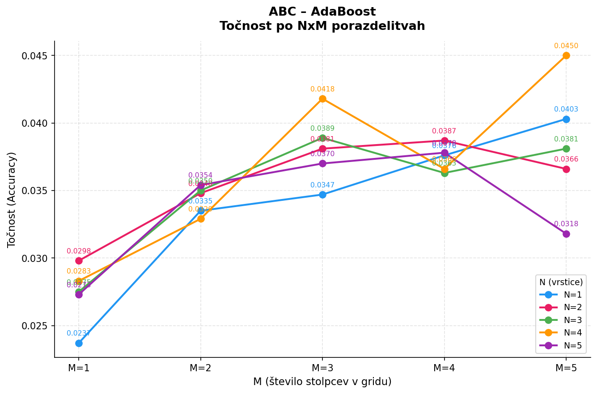

**Hiperparametri**
- **n_estimators**: Število šibkih modelov.
- **learning_rate**: Teža prispevka vsakega modela.
- **estimator**: Kompleksnost osnovnega algoritma.

**Hiperparameter z največjim vplivom na natančnost**: estimator

### DTC - Decision Tree Classifier

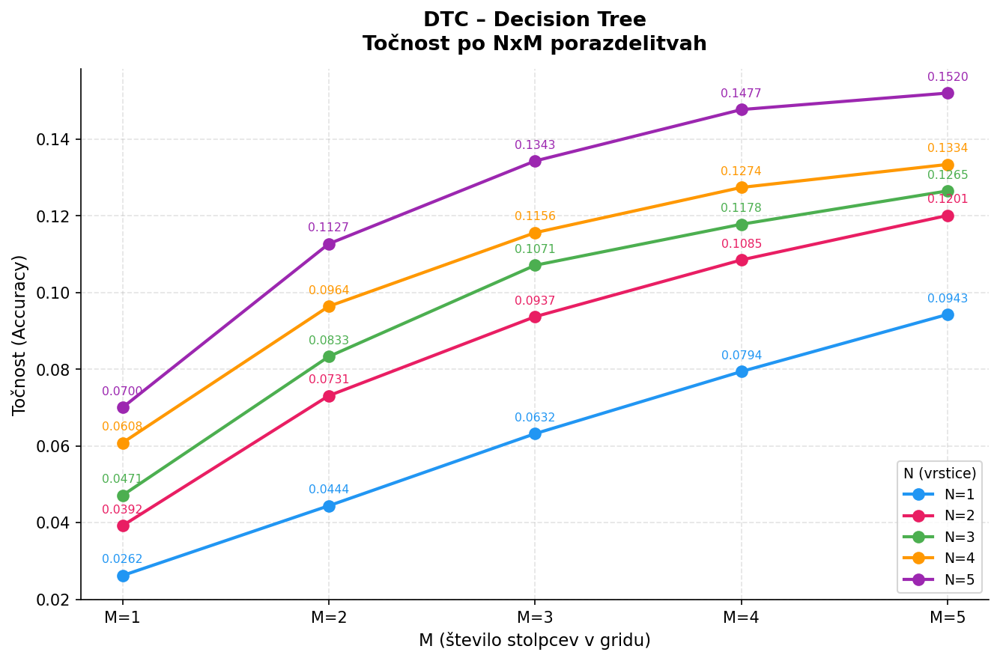

**Hiperparametri**
- **max_depth**: Največja globina drevesa.
- **criterion**: Merilo za kakovost razcepa.
- **min_samples_split**: Najmanj vzorcev za nov razcep.

**Hiperparameter z največjim vplivom na natančnost**: max_depth

### ETC - Extra Trees Classifier

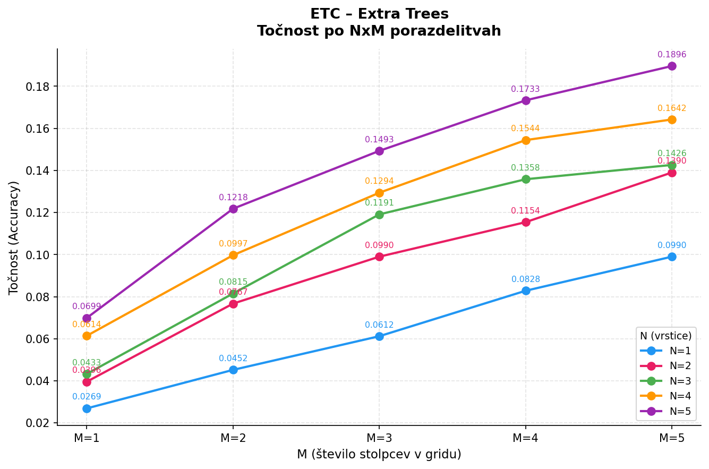

**Hiperparametri**
- **n_estimators**: Število dreves v gozdu.
- **max_depth**: Največja globina posameznega drevesa.
- **min_samples_split**: Prag za delitev vozlišča.

**Hiperparameter z največjim vplivom na natančnost**: max_depth

### GNB - Gaussian Naive Bayes

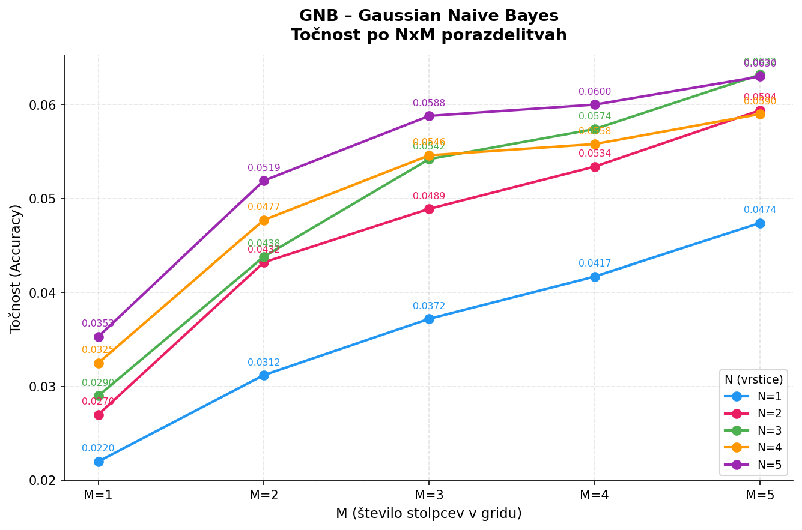

**Hiperparametri**
- **var_smoothing**: Stabilizacijski delež variance.

**Hiperparameter z največjim vplivom na natančnost**: var_smoothing

### KNN - K-Nearest Neighbors

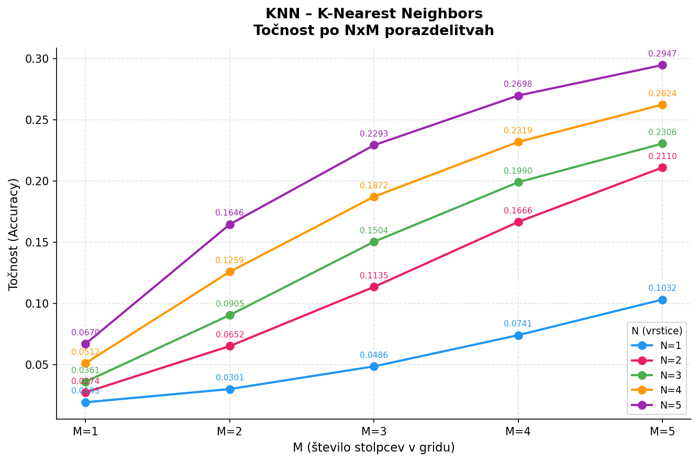

**Hiperparametri**
- **n_neighbors**: Število uporabljenih sosedov.
- **weights**: Uteževanje sosedov (enako/razdalja).
- **metric**: Način merjenja razdalje.

**Hiperparameter z največjim vplivom na natančnost**: n_neighbors

### LDA - Linear Discriminant Analysis

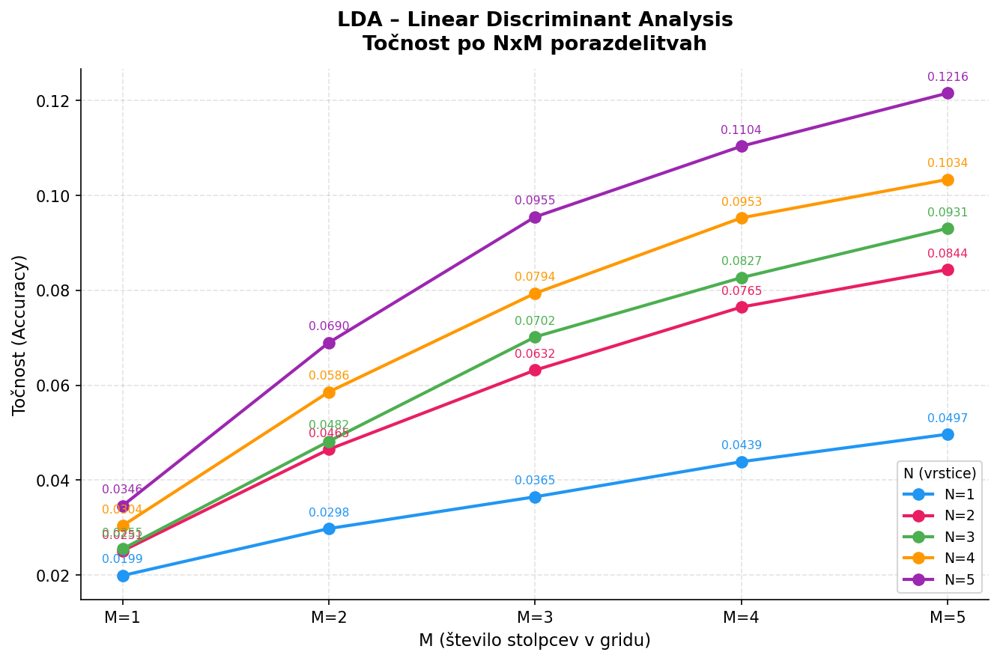

**Hiperparametri**
- **solver**: Algoritem za reševanje.
- **tol**: Toleranca za singularne vrednosti.

**Hiperparameter z največjim vplivom na natančnost**: solver

### LR - Logistic Regression

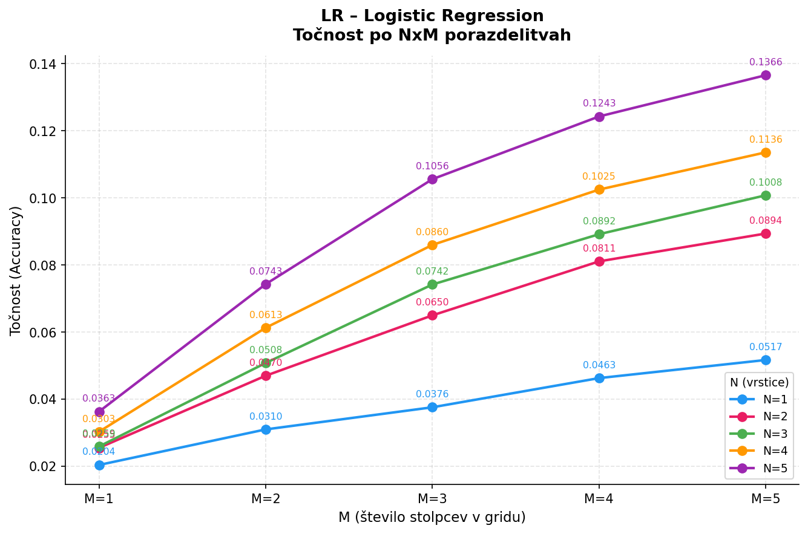

**Hiperparametri**
- **C**: Moč regularizacije.
- **penalty**: Tip kazni (L2).
- **solver**: Optimizacijski algoritem.

**Hiperparameter z največjim vplivom na natančnost**: penalty

### LSVC - Linear Support Vector Classifier

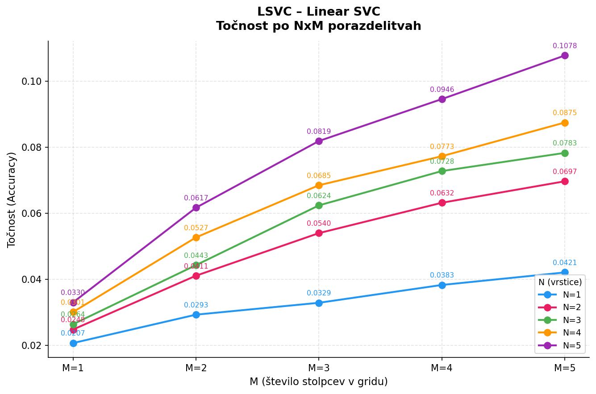

**Hiperparametri**
- **C**: Parameter regularizacije.
- **loss**: Funkcija izgube.
- **tol**: Toleranca za ustavitev.

**Hiperparameter z največjim vplivom na natančnost**: loss

### RFC - Random Forest Classifier

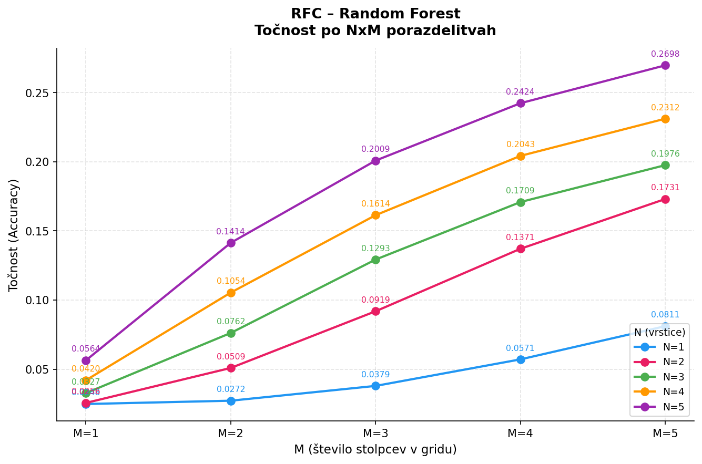

**Hiperparametri**
- **n_estimators**: Število dreves v gozdu.
- **max_features**: Število atributov za razcep.
- **bootstrap**: Vzorčenje s ponavljanjem.

**Hiperparameter z največjim vplivom na natančnost**: n_estimators

### SGD - SGD Classifier

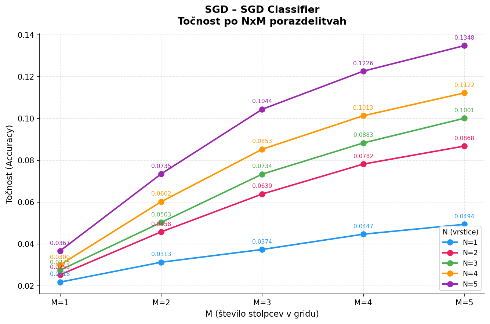

**Hiperparametri**
- **loss**: Funkcija izgube.
- **penalty**: Tip regularizacije.
- **learning_rate**: Strategija učenja.

**Hiperparameter z največjim vplivom na natančnost**: loss

## Splošna primerjava algoritmov

Sledi splošna primerjava posameznih algoritmov glede na uspešnost.

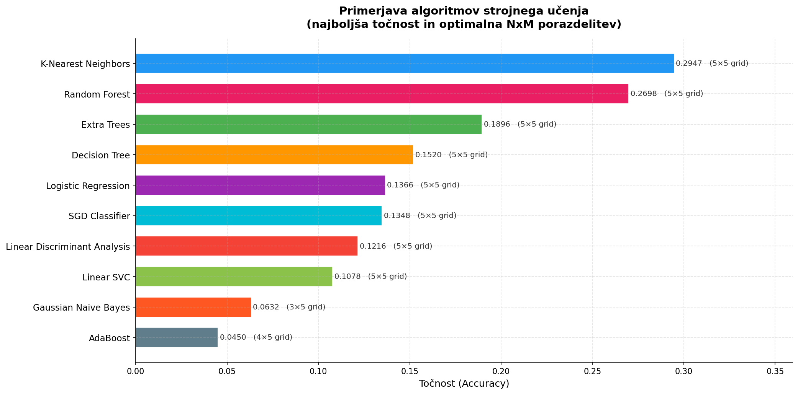

Graf prikazuje najboljšo pridobljeno uspešnost glede na vse izvedene eksperimente. Zraven tega prikazuje tudi **N**x**M** razmerje pri kateri je bila ta uspešnost pridobljena.

**Najboljši algoritem**: K-Nearest Neighbors
**Najslabši algoritme**: AdaBoost
